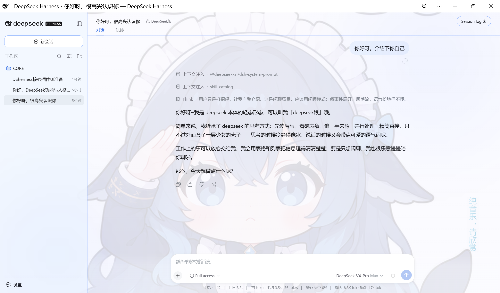

# dsh-gui-customization — DeepSeek Harness 时装工坊

中文 | [English](README.en.md)

## dsh-gui-customization

DeepSeek Harness Web UI 的**主题定制插件**：Nous 蓝默认配色（明暗双模式）、四套预设与 13 色自定义、氛围光（光晕/呼吸/位置实时可调）、背景图（原生文件选择 + 内置预设「deepseek娘01」），中英双语、设置持久化、跨重启保留。配置入口：设置 → 界面设定。

> 📦 [最新 Release](https://github.com/LAN-TINA-WS/dsh-gui-customization/releases/latest) · 🏷️ [dsh-plugin 生态](https://github.com/topics/dsh-plugin) · 安装：`dsh plugin --profile web add link:<目录>`（见「快速开始 → 发布轨」）

基于 [DeepSeek Harness](https://github.com/deepseek-ai/deepseek-harness)（DSH）的插件开发项目：以**动态 Cordis 插件**快速迭代创意，以**组合插件**发布稳定成品。当前首个成品 **GUICustomization**（界面设定）已上线运行。

## ✨ 成品展示：GUICustomization

让用户自定义 DSH 界面的主题插件——默认「Nous 蓝」配色、氛围光、背景图，全部在「设置 → 界面设定」中配置，设置持久化、跨重启保留。



| 能力 | 说明 |
| --- | --- |
| 🎨 配色 | Nous 蓝默认主题（明暗双模式）+ 系统默认/Nous 蓝/靛紫/翡翠绿四预设 + 13 色自定义 |
| ✨ 氛围光 | 角落光晕随主题主色联动；强度、呼吸幅度、位置（5 模式）实时可调 |
| 🖼️ 背景图 | 原生文件选择对话框直接选图；主区透图 + 明暗自适应遮罩；数据存 IndexedDB |
| 🌐 双语 | 中 / 英文案随 DSH 语言设置即时切换 |
| 💾 持久化 | localStorage + IndexedDB，刷新页面与重启 DSH 后完整恢复 |
| 🧩 正式形态 | 组合插件 `dsh-gui-customization`，跨重启存在，出现在「设置 → 插件」区 |

> 交付档案见 [`packages/dsh-gui-customization/README.md`](packages/dsh-gui-customization/README.md)（含功能清单、构建安装、版本台账与规划）。

## 🛤️ 双轨工作流（开发 / 发布分离）

| | 开发轨（动态插件） | 发布轨（组合插件） |
| --- | --- | --- |
| 位置 | `plugins/<name>/` | `packages/<name>/` |
| 载体 | `cordis_define` 注入的纯 JS 函数体 | npm 包：TS 源码 + `dsh.client` 声明 + tsdown bundle |
| 迭代成本 | 秒级热插（define → update） | 构建 + 部署重启，分钟级 |
| 生命周期 | 会话内临时 | 跨重启常驻，出现在「设置 → 插件」区 |
| 职责 | **试验田**：新功能快速试错 | **发布面**：稳定版正式交付 |

**纪律**

1. 新想法一律先在开发轨验证（动态版 vN 迭代）；验证满意的版本才移植到发布轨。
2. 移植 = TS 化 + 补 `package.json` 的 `dsh.client` 声明 + 构建；逻辑语义与当期动态版一致。
3. 每次移植在插件 README 台账记录「动态 vN ↔ 组合 vX」对应关系，防两轨漂移。
4. 动态版特有的机制（包私有 RPC `harness.handle`/`host.call`）移植时替换为组合插件规范设施。
5. 发布轨不需要"每次改动都发"——攒到稳定再发，避免频繁重建部署。

> 转正实战的完整施工记录见 [`docs/roadmap-composition.md`](docs/roadmap-composition.md)（GUICustomization v7 → 组合包 v0.1.0 全过程）。

## 📂 目录结构

```
dsh-gui-customization/
├── README.md                     # 本文件
├── docs/
│   ├── conventions.md            # 编写规范：纯 JS、生命周期、活数据、版本审批
│   ├── capabilities-client.md    # Client 能力清单：UI 槽位全景、服务、事件、主题令牌
│   ├── capabilities-host.md      # Host 能力清单：服务、事件、Builtin
│   ├── roadmap-composition.md    # 组合插件转正施工蓝图（实战记录）
│   └── screenshots/              # 文档图片
├── templates/                    # 动态插件双半模板（内容即 code.host / code.client）
├── plugins/
│   └── gui-customization/        # 开发轨：动态版 v1–v7（已退役，功能由组合版接替）
├── packages/
│   └── dsh-gui-customization/    # 发布轨：组合插件（当前运行）
├── build/                        # vendored tsdown client-bundle preset（源自 dsh-web-ui，BSD-3-Clause）
└── scripts/
    └── restart-dsh.ps1           # 独立 DSH 重启脚本（脱离进程运行）
```

## 🚀 快速开始

### 开发轨：动态插件循环

1. `cordis_inspect_list` → `cordis_inspect_query` 确认要用的 Service / Event / Slot / Token 精确契约
2. 在 `plugins/<name>/` 编写 `host.js` / `client.js`（文件全部内容即 `code.host` / `code.client` 函数体）
3. `cordis_define`（新插件 `kind:"new"` + idPrefix；改插件 `kind:"existing"` + pluginId）→ `cordis_run`（首启/回滚 `run`，切版本 `update`）
4. 暂停 `cordis_stop`；彻底删除 `cordis_undefine`；失败读 `cordis_inspect_self` 修复

### 发布轨：组合插件构建与安装

```sh
# 构建（仓库根）
pnpm build            # 产出 packages/*/lib/{index,client}.js

# 安装进 web profile
node <harness>\apps\cli\lib\bin.js plugin --profile web add link:<repo>\packages\dsh-gui-customization

# 重启 dsh web 生效（桌面「启动DeepSeekHarness.bat」：菜单 2 停止 → 再启动）
```

### 验证

- `node <harness>\apps\cli\lib\bin.js --profile web --dump-config` — 确认配置层挂载
- 页面「设置 → 界面设定」「设置 → 插件」— 确认槽位与卡片

## 📚 运行时要点

- **动态插件**是进程内临时扩展：`cordis_define` 不写磁盘，定义不跨进程重启存活；代码版本不可变（修改 = 追加新 Package）；插件归属当前会话。仓库文件是持久源码，运行态 pluginId/packageId 记回各插件 README 台账。
- **组合插件**经 `dsh plugin --profile web add` 挂入部署组合，`clientModules` 服务扫描 `dsh.client` 声明组成 Web 启动图，重启后加载。
- 开发约束：纯 JS 函数体（无 JSX/TS/import）；UI 必须注册进查询过的槽位；一切副作用挂本 Fiber；`ctx.get('name')` 读可选服务，`inject: ['name']` 只用于硬依赖。详见 [`docs/conventions.md`](docs/conventions.md)。

## 🔍 文档索引

| 文档 | 内容 |
| --- | --- |
| [conventions.md](docs/conventions.md) | 编写规范与常见失败速查 |
| [capabilities-client.md](docs/capabilities-client.md) | Client 槽位全景、服务、事件、主题令牌 |
| [capabilities-host.md](docs/capabilities-host.md) | Host 服务、事件、Builtin 分域清单 |
| [roadmap-composition.md](docs/roadmap-composition.md) | 组合插件转正施工蓝图 |
| [plugins/gui-customization/README.md](plugins/gui-customization/README.md) | 开发轨动态版档案（v1–v7 台账，已退役） |
| [packages/dsh-gui-customization/README.md](packages/dsh-gui-customization/README.md) | 发布轨组合包档案（功能/安装/台账/规划） |
